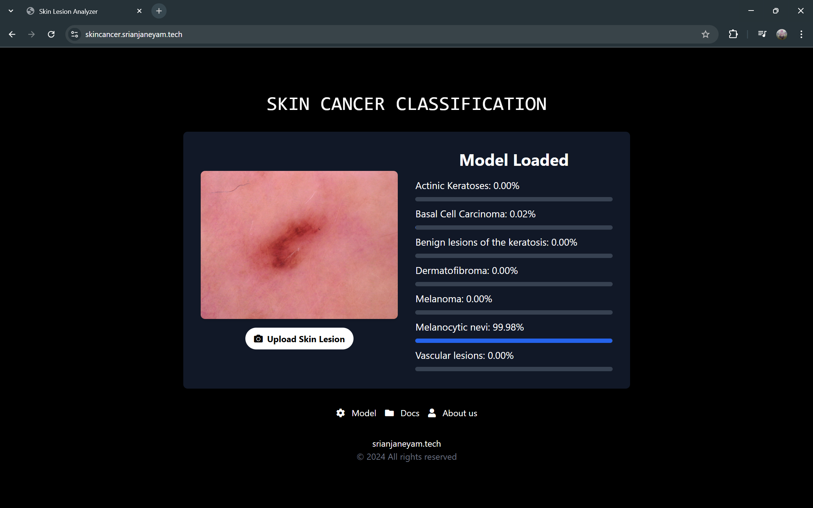
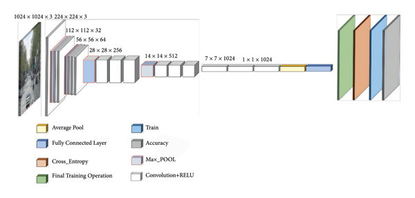

# 🌐 Skin Cancer Classification with MobileNet

This project demonstrates an advanced approach for skin lesion classification, leveraging MobileNet to identify seven types of skin cancers. Developed with a focus on efficiency and accuracy, this project explores the use of deep learning in dermatological diagnostics. 🚀

## 📑 Table of Contents
- [🔍 Overview](#overview)
- [✨ Key Features](#key-features)
- [💻 Technologies Used](#technologies-used)
- [📊 Dataset](#dataset)
- [🏛 Model Architecture](#model-architecture)
- [📈 Results](#results)
- [📅 Future Prospects](#future-prospects)
- [📝 License](#license)

## 🔍 Overview
Skin cancer is one of the most prevalent cancers worldwide, making early and accurate detection essential. This project uses MobileNet, a Convolutional Neural Network (CNN), fine-tuned on the HAM10000 dataset, to classify skin lesions automatically. The solution provides an efficient diagnostic tool that can assist dermatologists in early cancer detection.

## ✨ Key Features
- **Multiclass Classification**: Capable of distinguishing between seven types of skin lesions.
- **Lightweight Model**: The MobileNet architecture ensures efficient performance suitable for real-time applications.
- **High Accuracy**: Fine-tuned using the HAM10000 dataset, achieving up to 89.21% accuracy.

## 💻 Technologies Used
- **Machine Learning**: Python, TensorFlow, and Keras for model building and training
- **Data Analysis**: NumPy and Pandas for data processing
- **Visualization**: Matplotlib for plotting metrics and performance

## 📊 Dataset
The project uses the [HAM10000 dataset](https://www.kaggle.com/kmader/skin-cancer-mnist-ham10000), which includes 10,015 high-resolution dermatoscopic images. The dataset is annotated and consists of images from seven skin lesion categories:
- Actinic Keratoses
- Basal Cell Carcinoma
- Benign Keratosis-like Lesions
- Dermatofibroma
- Melanoma
- Melanocytic Nevi
- Vascular Lesions

## 🏛 Model Architecture
The MobileNet architecture, designed for mobile and embedded applications, is employed here. It uses depthwise separable convolutions to reduce the computational load without compromising accuracy. The model is fine-tuned with transfer learning to classify the skin lesions effectively.

## 📈 Results
- **Accuracy**: Achieved an overall accuracy of 89.21%, with top-2 accuracy of 96.55% and top-3 accuracy of 98.45%.

## 📅 Future Prospects
- Further testing with other CNN architectures for potential performance gains.
- Enhanced data augmentation techniques to improve model generalization.
- Future plans include exploring a mobile-based application for real-time skin lesion classification.

## 📝 License
This project is licensed under the MIT License.

